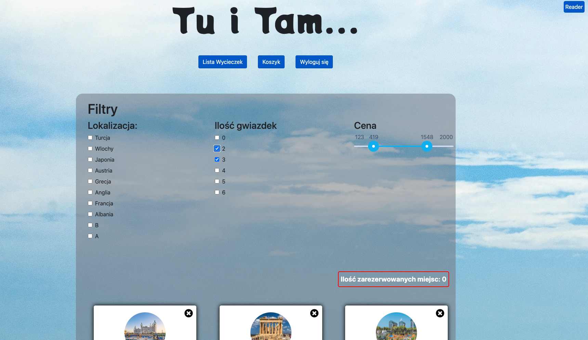
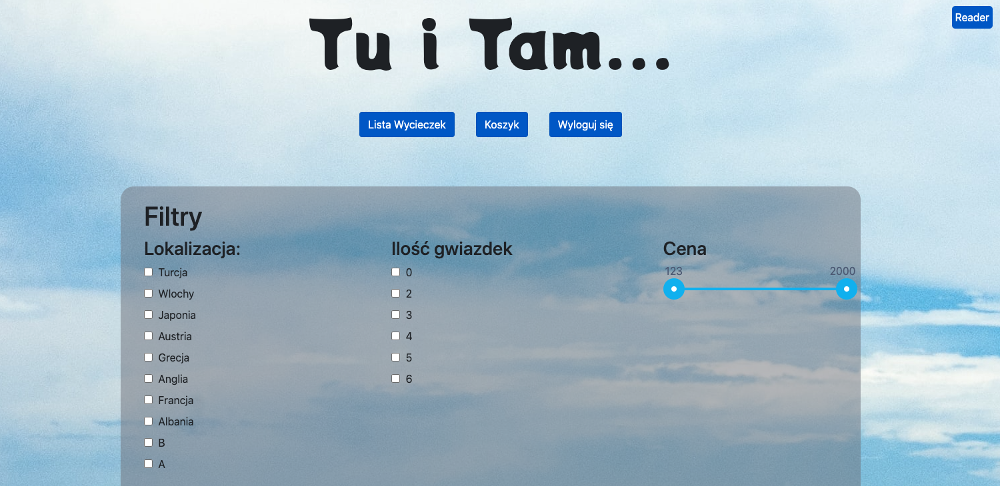
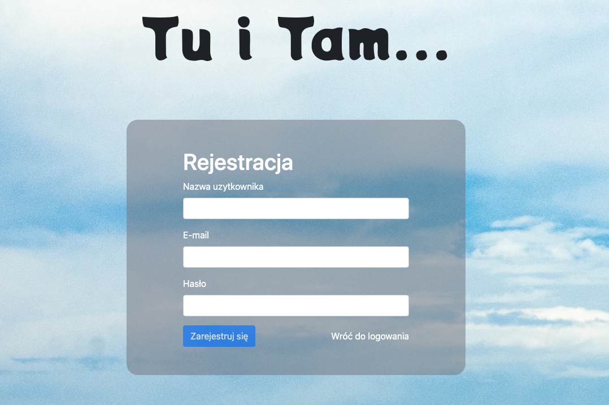
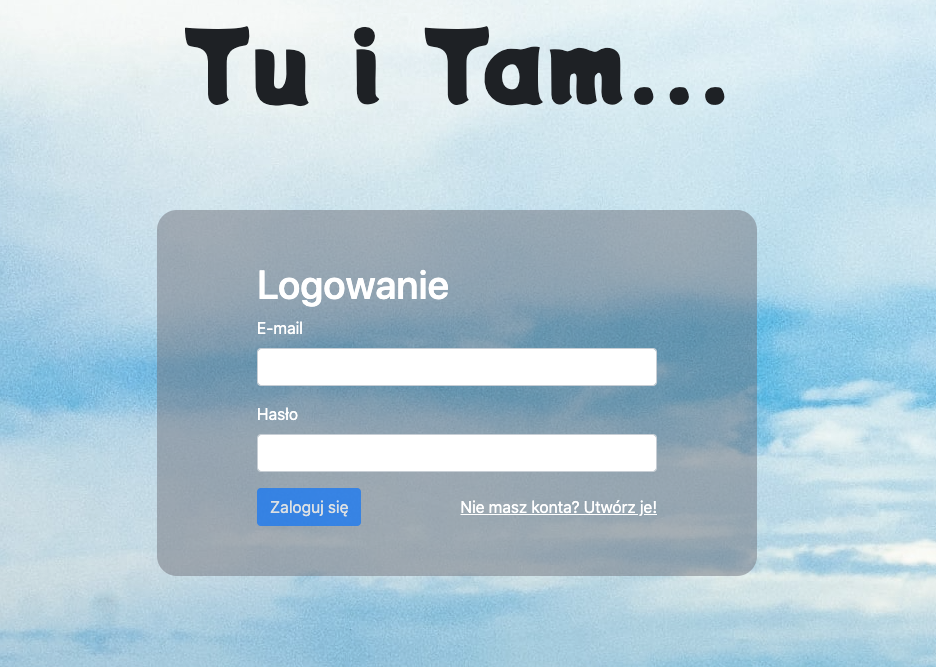
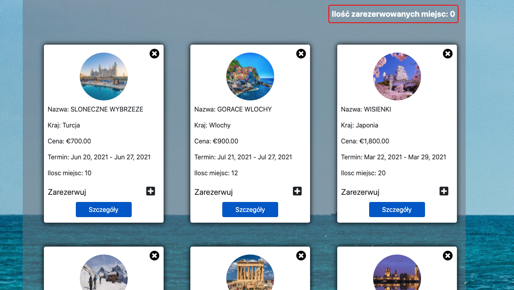
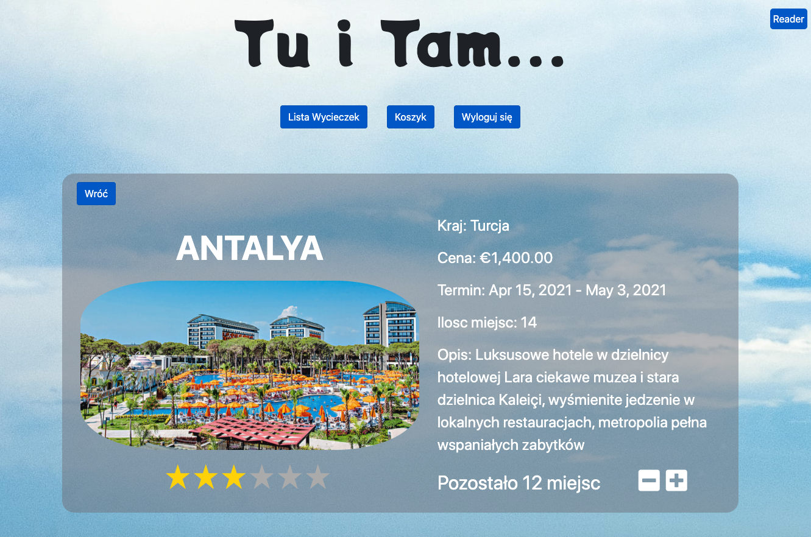
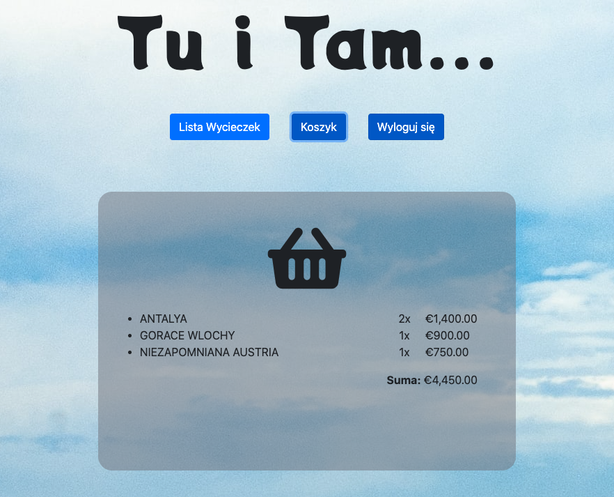
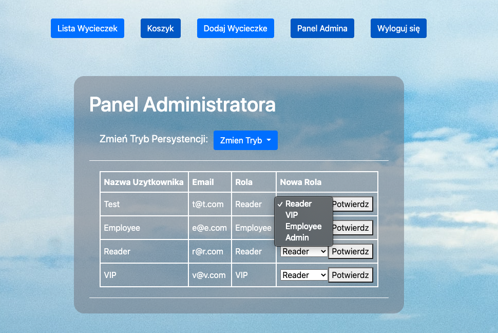
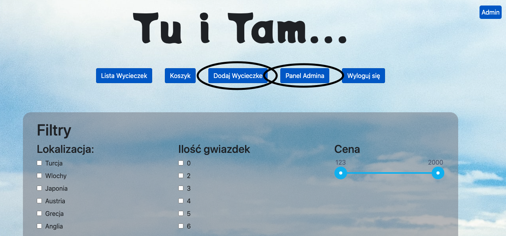
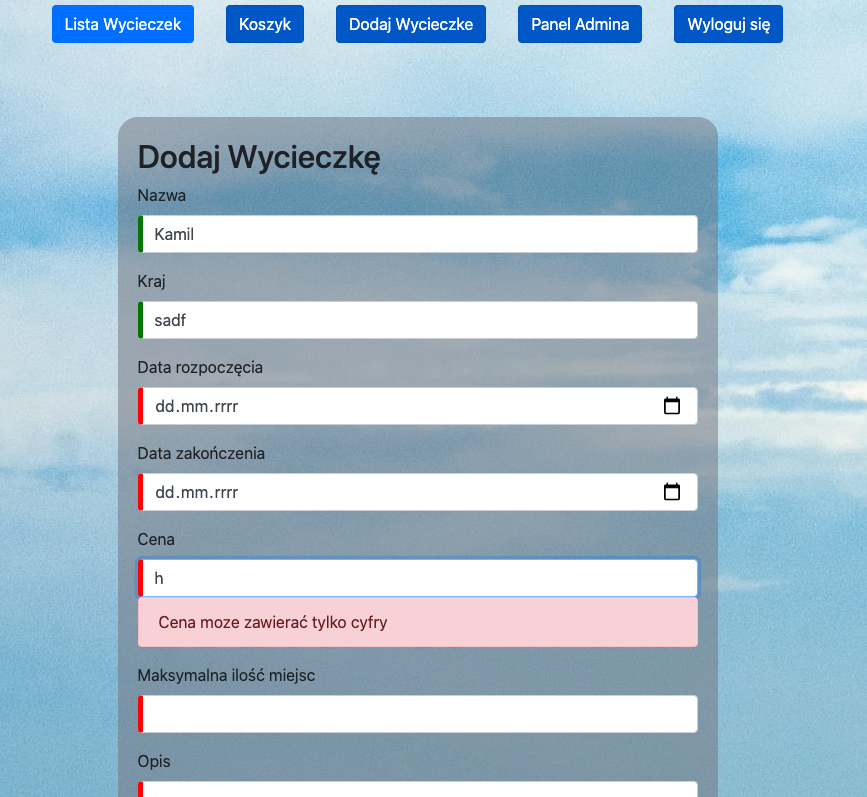

TravelAgency
---

Technologies used:
- Angular
- Typescript
- HTML
- CSS
- Firebase

##### What is Travel Agency?
Travel Agency is website to book your dream holiday. 

On main page you can choose interesting you filters like location,
rating, price range which works simultaneously (Angular Custom Pipes)

But let's start from the beginning to use my website firstly you must sign up.

Then you can log in.
The app uses Angular Routing and AuthGuards so you can't access other components without logging in.

You can browse the tours on the main page but when something interest you, you can go to the detailed view.

If you book something, it immediately appears in the trolley.

Application differentiate 4 types of users:
- Reader
- VIP (can rate tours)
- Employee (like VIP + can add new tour)
- Admin (like Employee + have admin panel so he can update roles, change persistance mode)

Navigation panel differs according user role!
Admin views:

